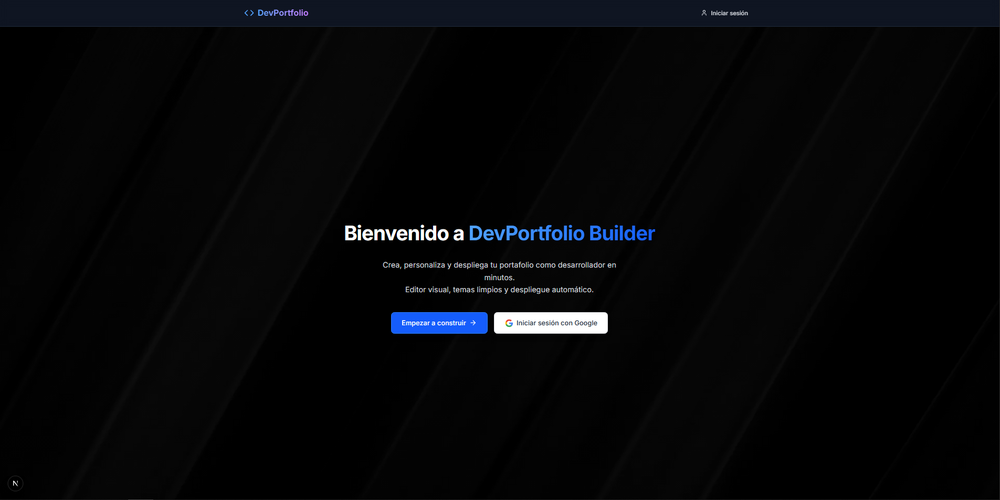
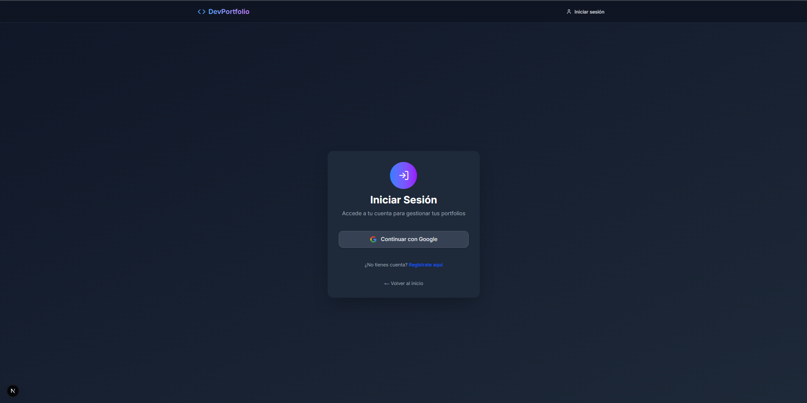
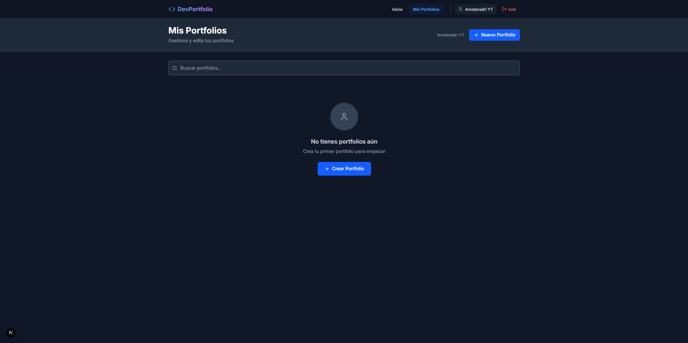
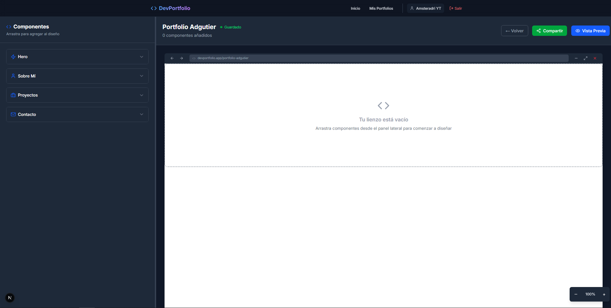
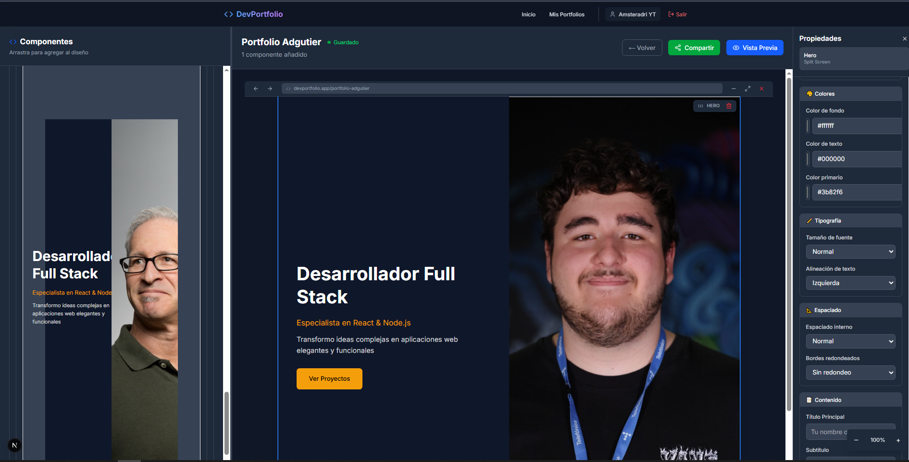
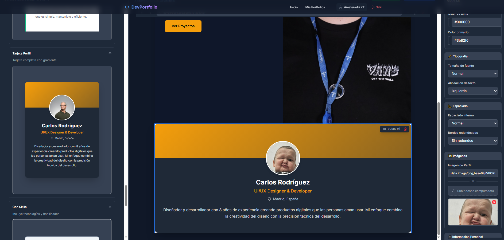
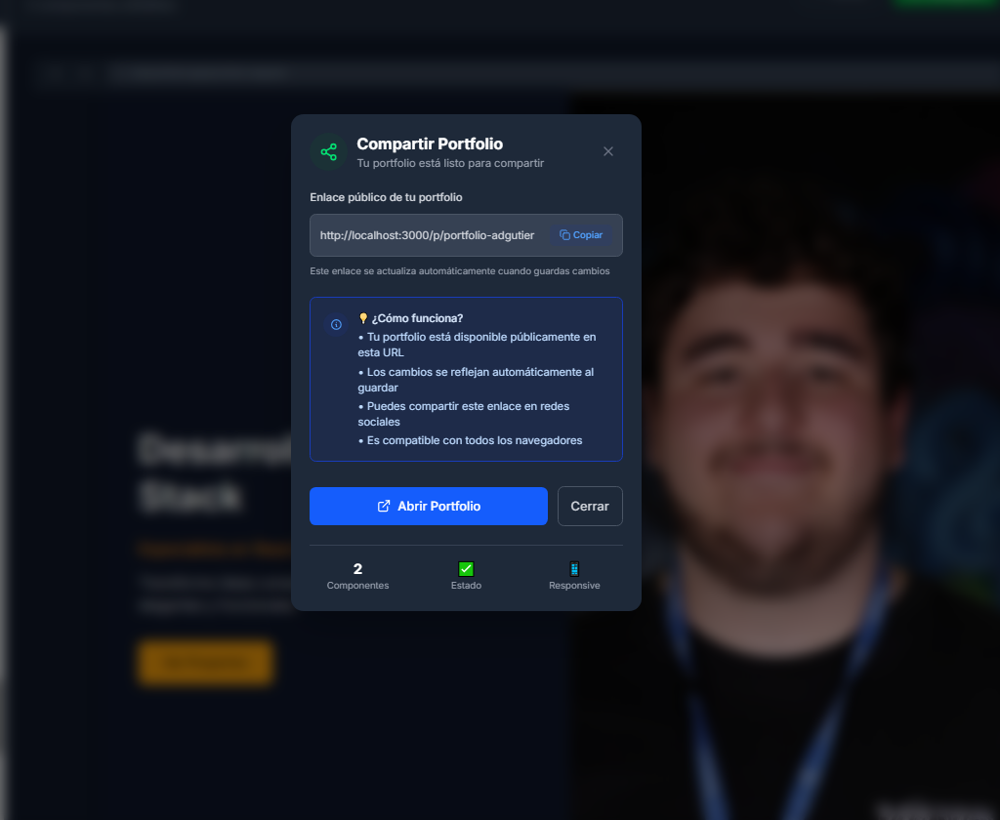
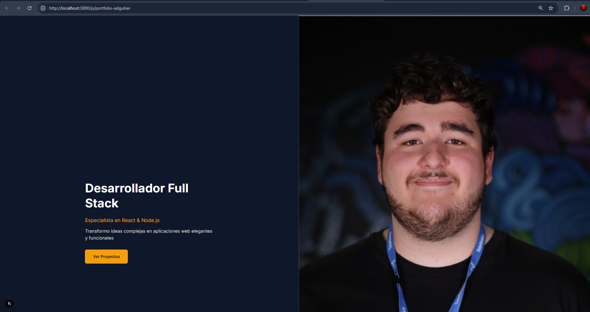

# 🚀 DevPortfolio Builder

Portfolio generator for developers with a visual editor, customizable themes, and export to GitHub Pages or ZIP.

---

## 🖼️ What is DevPortfolio Builder?

DevPortfolio Builder is a web platform that allows you to create your professional portfolio instantly, for free, and without any coding skills. Just log in with your Google account (OAuth 2.0), choose and edit visual components, and your portfolio will be saved and available in the cloud. Perfect for showcasing your projects and skills to the world in minutes!

### Main Features
- **Visual drag & drop editor:** Easily add, move, and customize content blocks.
- **Editable components:** Personalize your info, projects, social links, skills, and more.
- **Data persistence:** Your portfolios are saved in the cloud and can be edited anytime.
- **User accounts:** Secure access via Google OAuth 2.0.
- **Export:** Publish your portfolio to GitHub Pages or download it as a ZIP file.
- **Instant public view:** Share your portfolio with a unique URL.
- **Advanced options:** Themes, live preview, portfolio duplication, multi-portfolio management, and more.

---

## 🖥️ Visual Flow & Main Features

Below you can see the main screens and user flow of the application:

### 1. Landing page



- Welcome screen introducing the platform and its benefits. Start with a single click.

### 2. Log in page



- Secure login with Google. Your data is always protected and you can access your portfolios from anywhere.

### 3. Portfolios dashboard



- View all your saved portfolios, search, edit, duplicate, or delete them easily.

### 4. Visual drag and drop editor



- Drag and drop components, edit text, images, colors, and structure your portfolio in real time.

### 5. Properties and customization panel



- Customize each block/component with advanced options: text, colors, images, links, and more.

### 6. Many available components



- Choose from a wide variety of ready-to-use components to build a unique and professional portfolio.

### 7. Account and profile management



- Access your profile, manage your data and portfolios, and log out securely.

### 8. Final experience and public portfolio



- Share your portfolio with a unique and professional URL. Ready to show the world!

---

## 🛠️ Main Technologies

- **Frontend:** Next.js 15, React 18, Tailwind CSS, TypeScript, dnd-kit, Lucide, Framer Motion
- **Backend:** FastAPI, SQLAlchemy, Authlib, Pydantic, Uvicorn, httpx
- **Database:** PostgreSQL 15
- **Authentication:** OAuth2 Google
- **Containers:** Docker, Docker Compose

---

## 🏗️ Architecture

```
DevPortfolio-Builder/
├── backend/         # REST API (FastAPI)
│   └── app/
│       ├── api/         # Endpoints (auth, portfolios)
│       ├── services/    # Business logic
│       ├── models.py    # SQLAlchemy models
│       ├── schemas.py   # Pydantic schemas
│       ├── database.py  # DB connection
│       └── migrate.py   # Automatic migrations
├── frontend/        # Next.js application
│   └── src/app/
│       ├── editor/      # Visual drag & drop editor
│       ├── login/       # Google login
│       ├── profile/     # User profile
│       ├── preview/     # Portfolio preview
│       ├── portfolios/  # Portfolio management
│       ├── p/[name]/    # Public portfolio
│       └── auth/        # Login callback and feedback
├── docker-compose.yml   # Service orchestration
└── .env                 # Environment variables
```

---

## 🌐 Backend Endpoints (FastAPI)

### Authentication
- `GET /auth/login` — Redirects to Google OAuth
- `GET /auth/callback` — Google OAuth callback
- `GET /auth/logout` — Log out
- `GET /auth/me/{user_id}` — User info
- `GET /auth/users` — List all users

### Portfolios
- `GET /api/portfolios/user/{user_id}` — User's portfolios
- `POST /api/portfolios/` — Create portfolio
- `GET /api/portfolios/{portfolio_id}` — Get portfolio by ID
- `GET /api/portfolios/name/{portfolio_name}` — Get portfolio by name
- `PUT /api/portfolios/{portfolio_id}` — Update portfolio
- `DELETE /api/portfolios/{portfolio_id}` — Delete portfolio
- `POST /api/portfolios/{portfolio_id}/duplicate` — Duplicate portfolio

---

## 🖥️ Main Frontend Routes (Next.js)

- `/` — Landing page
- `/login` — Google login
- `/register` — User registration
- `/editor` — Visual drag & drop editor
- `/portfolios` — Portfolio list and management
- `/profile` — User profile
- `/preview` — Portfolio preview
- `/p/[name]` — Public portfolio (friendly URL)
- `/auth/success` — Login success
- `/auth/error` — Login error

---

## 🐳 Deploy & Usage with Docker Compose

1. Copy the `.env.example` file to `.env` and set your variables (Google OAuth, DB, etc).
2. Run:

```bash
docker compose up --build
```

3. Access:
   - Frontend: [http://localhost:3000](http://localhost:3000)
   - Backend: [http://localhost:8000/docs](http://localhost:8000/docs) (Swagger)

---

## ✅ Project Status

- [x] Next.js frontend with visual drag & drop editor
- [x] FastAPI backend with RESTful endpoints
- [x] Google OAuth authentication
- [x] Portfolio CRUD
- [x] Export and public view of portfolios
- [x] Full dockerization
- [x] Automatic database migrations
- [x] User and profile management
- [x] Protected routes and login feedback

---

## 📚 API Usage Example

```http
# Get a user's portfolios
GET /api/portfolios/user/1

# Create a portfolio
POST /api/portfolios/
{
  "name": "My Portfolio",
  "content": { ... },
  "user_id": 1
}

# Duplicate a portfolio
POST /api/portfolios/2/duplicate
```

---

## 🚀 What can you learn with this project?

- Modern fullstack architecture (Next.js + FastAPI)
- OAuth2 integration (Google)
- Advanced drag & drop in React
- Professional dockerization
- State management and protected routes
- REST API best practices

---

## 👨‍💻 Author

- Adrián Gutiérrez (amsteradri@gmail.com)

---

Project finished and ready for production! 🎉